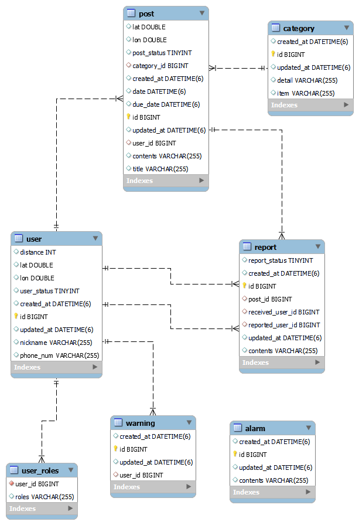

# [동동 - 동네 동아리]
함께 취미 생활을 할 사람을 모집할 수 있는 위치 기반 서비스

## :mag_right:프로젝트 소개
- 여러 사람이 함께 하고 싶은 활동을 위치 기반으로 모집 게시글을 작성할 수 있다.
- 활동을 찾는 사람은 본인 위치를 기반으로 전방 3km, 5km, 10km 내에 있는 게시글을 찾아 지원한다.

- 개발 기간 : 2024/01/15 ~ 2024/02/19

* * *

## :mag_right:개발환경

* Java (17)
* Gradle
* Spring boot (3.1.8)
* Spring Data JPA
* MySQL
* Spring Security
* JWT
* Lombok

* [네이버 문자 전송 API](https://api.ncloud-docs.com/docs/ai-application-service-sens-smsv2)

* * *

## :mag_right:ERD

* * *
## :mag_right:주요기능
### <회원>
- ID
- 동물ID
- 닉네임
- 핸드폰 번호
- 위치(위도, 경도)
- 거리 : 3km, 5km, 10km
- status : 활동, 활중, 탈퇴, 정지

> * **회원가입** : 핸드폰으로 문자를 받아 본인 인증을 진행한다. (네이버 클라우드 문자전송 api 사용)
> * **로그인** : 등록되지 않은 핸드폰의 경우 회원가입으로 넘어간다. 등록된 계정은 핸드폰 문자로 본인 인증 진행
> * **동네 설정** : 현재 위치 update 및 거리 지정(3km, 5km, 10km)
> * **회원 정보 수정** : 동물, mbti 수정 / 닉네임은 수정 불가
> * **회원 정보 상세 조회** : 경고 받은 횟수도 알려준다.

### <신고>
- ID
- 신고한 회원ID
- 신고 받은 회원ID
- 모집 ID
- 사유
- status : 확인 전, 확인

> * **신고 등록**
> * **신고 목록 조회**(관리자) : 신고 목록 전체 검색
> * **신고 받은 회원별 검색**(관리자) : 회원ID로 신고 내역 검색
> * **신고 확인**(관리자) : 관리자가 확인 한 신고의 status를 바꾼다.

### <경고>
- ID
- 회원ID

> * **경고 등록**(관리자) : 관리자 권한으로 경고를 보내고 경고가 3회 이상 누적된 회원은 자동으로 활동이 정지되어 게시글을 쓰거나 지원할 수 없다.
> * **경고 목록 조회**

### <알림>
- ID
- 회원ID
- 알림 내용

> * **알림 발송**(관리자) : 3회 이상 신고 받은 회원이 존재하는 경우 관리자에게 알림을 날린다.
> * **알림 목록 조회**(관리자)

### <모집>
- ID
- 모집한 회원 ID
- 제목
- 카테고리
- 내용
- 위치
- 일시
- 모집 마감 날짜
- status : 활성, 삭제

> * **모집 게시글 작성**
> * **게시글 삭제** : 마감 시간 6시간 전 부터는 삭제 불가능
> * **게시글 목록 조회** : 회원이 설정한 거리별로 조회
> * **게시글 상세 조회** : 상세 내용 및 현재 지원자 수도 알려준다.
> * **마감 스케줄러** : 마감 시간이 지나면 스케줄러가 자동으로 status를 비활로 바꿔준다.

### <지원>
- ID
- 모집ID
- 지원한 회원 ID

> * **지원**
> * **지원 취소** : 모집 마감 시간 8시간 전 부터는 취소 불가능

### <동물 캐릭터>

- ID
- 동물

> ex) 하마, 원숭이, 뱀, 고양이,강아지, 햄스터, 쿼카, 거북이, 토끼, 양, 새

### <카테고리>
- ID
- 항목
- 종류
> ex)
> * 항목 : 운동
> 
>  종류 : 러닝, 헬스, 축구, 배드민턴, 자전거
>
> * 항목 : 취미 생활
>
>  종류 : 보드게임, 노래방, 뜨개질, 베이킹, 댄스, 미술
> * 항목 : 자기 계발
>
>  종류 : 독서, 업무, 공부, 언어

* * *
## :mag_right:Trouble Shooting

1. 문제
- 해결법
- 참고 자료
- 새롭게 알게된 지식
2. 문제
- 해결법
- 새롭게 알게된 지식
3. 문제
- 해결법
- 새롭게 알게된 지식